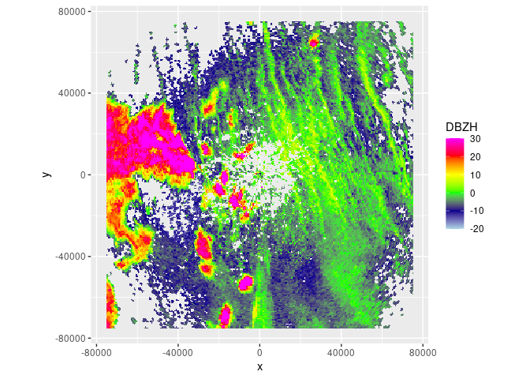
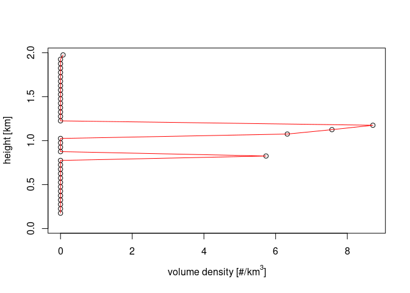
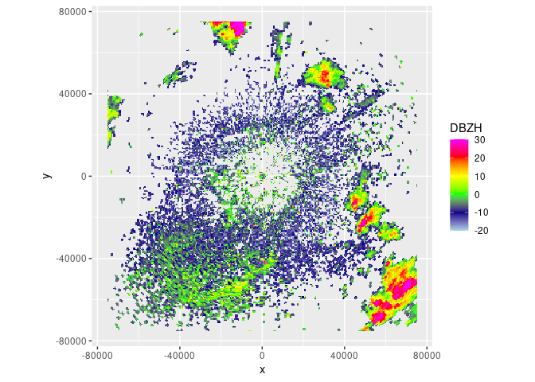
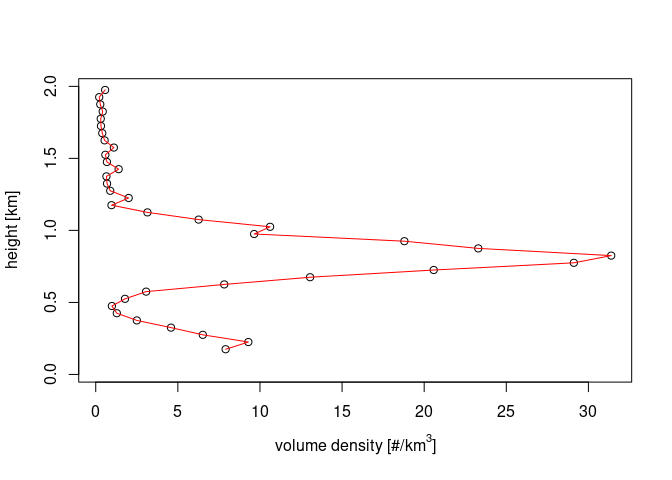
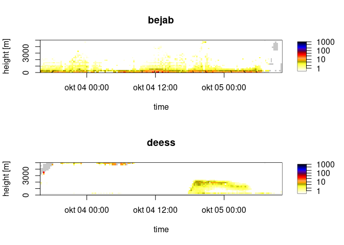

<!-- README.md is generated from README.Rmd. Please edit that file -->

# getRad

<!-- badges: start -->

[](https://CRAN.R-project.org/package=getRad)
[](https://github.com/aloftdata/getRad/actions/workflows/R-CMD-check.yaml)
[](https://app.codecov.io/gh/aloftdata/getRad/)
[](https://www.repostatus.org/#active)
<!-- badges: end -->

getRad is an R package that provides a unified interface to download
radar data for biological and aeroecological research. It gives access
to both polar volume radar data and [vertical profile
data](https://aloftdata.eu/vpts-csv/) from [different
sources](https://aloftdata.github.io/getRad/articles/supported_sources.html)
and loads it directly into R. getRad also facilitates further
exploration of the data by other tools such as
[bioRad](https://adriaandokter.com/bioRad/) by standardizing the data.

## Installation

Install the latest released version from CRAN:

``` r
install.packages("getRad")
```

Or the development version from
[GitHub](https://github.com/aloftdata/getRad):

``` r
# install.packages("devtools")
devtools::install_github("aloftdata/getRad")
```

## Usage

Download a polar volume, and then plot it using `bioRad`:

``` r
library(getRad)
library(bioRad)
# Plot daytime insect movements in Finland (Mäkinen et al. 2022)
pvol <- get_pvol("fianj", as.POSIXct("2012-05-17 14:00", tz = "UTC"))
plot(project_as_ppi(get_scan(pvol, 0), range_max = 75000))
```



``` r
plot(calculate_vp(pvol, h_layer = 50, n_layer = 40, warning = FALSE))
```



``` r

# Plot nocturnal migration in Finland
pvol <- get_pvol("fianj", as.POSIXct("2012-05-11 23:00", tz = "UTC"))
plot(project_as_ppi(get_scan(pvol, 0), range_max = 75000))
```



``` r
plot(calculate_vp(pvol, h_layer = 50, n_layer = 40, warning = FALSE))
```



Download a vertical profile time series from the [Aloft
bucket](https://aloftdata.eu/browse/):

``` r
# Plot VPTS data for two radars
vpts_list <- get_vpts(
  radar = c("bejab", "deess"),
  datetime = lubridate::interval(
    lubridate::as_datetime("2021-10-03 16:00:00"),
    lubridate::as_datetime("2021-10-05 10:00:00")
  ),
  source = "baltrad"
)
par(mfrow = 2:1)
for (i in names(vpts_list)) {
  plot(regularize_vpts(vpts_list[[i]]), main = i)
}
```



## Meta

- We welcome
  [contributions](https://aloftdata.github.io/getRad/CONTRIBUTING.html)
  including bug reports.
- License: MIT
- Get [citation
  information](https://aloftdata.github.io/getRad/authors.html#citation)
  for getRad in R doing `citation("getRad")`.
- Please note that this project is released with a [Contributor Code of
  Conduct](https://aloftdata.github.io/getRad/CODE_OF_CONDUCT.html). By
  participating in this project you agree to abide by its terms.
